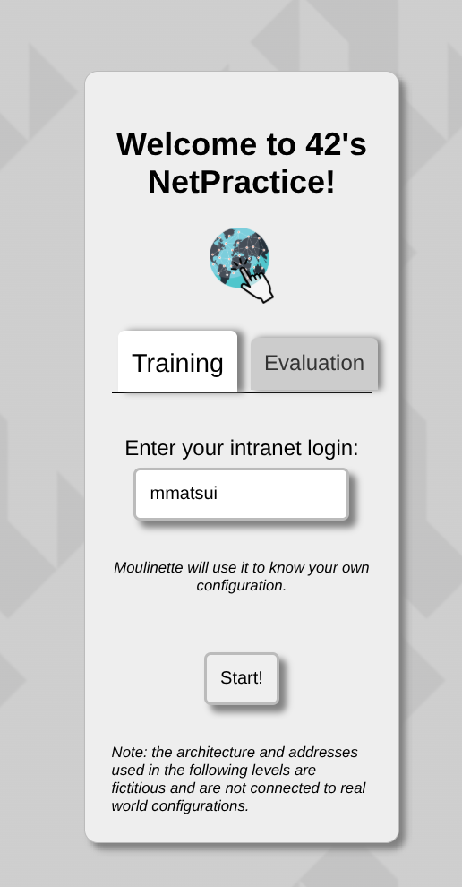
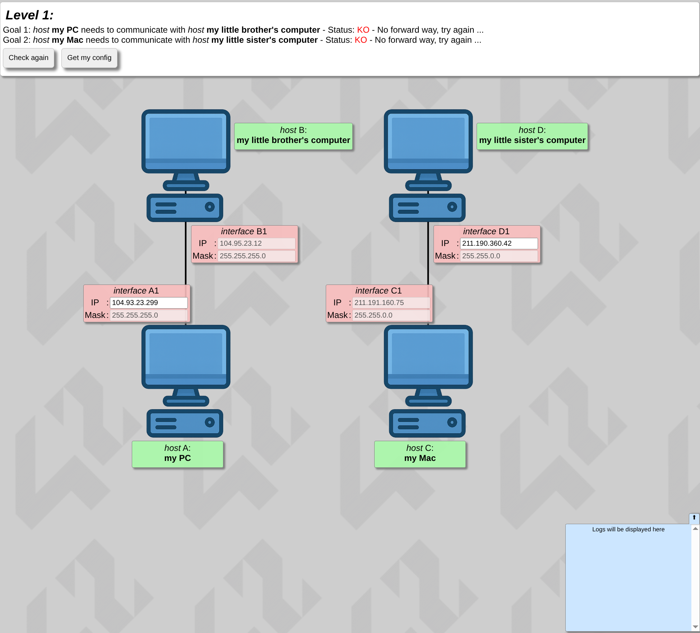
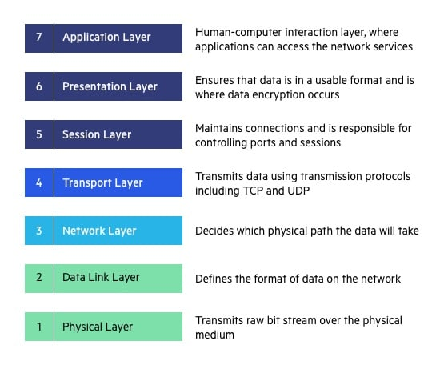
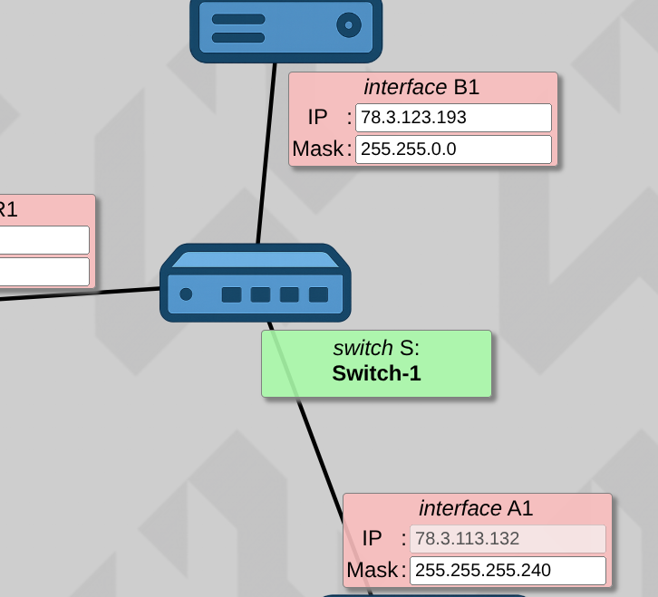
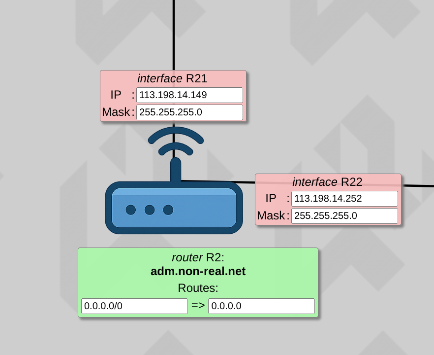
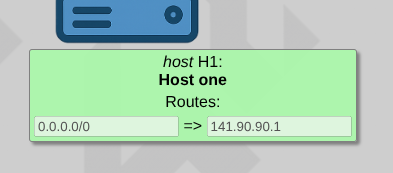
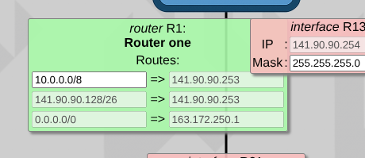

*This project has been created as part of the 42 curriculum by mmatsui.*
# NetPractice - 42
## Description
NetPractice is a hands-on networking project from the 42 curriculum designed to introduce fundamental computer networking concepts through interactive problem-solving.

The goal of this project is to configure non-functioning network diagrams so that communication between devices works correctly. Across 10 progressive levels, the student must troubleshoot and fix network configurations by adjusting IP addresses, subnet masks, default gateways, and routing settings.


## Instructions
### ⚒️Download and Setup the training interface
1. Download the NetPractice file attached to the project page.
2. Extract the archive into a folder of your choice.
3. Navigate into the extracted folder.
4. Open any level file (e.g., level1.html) in a web browser.

*It is recommended to use Google Chrome or another Chromium-based browser, as some browsers (e.g., Firefox) may block the tool due to security restrictions.*

### 💻Using the Training Interface
Once the interface opens in your browser:<br>
Enter your 42 login in the input field to generate your personal configuration.<br>
Alternatively, use the “evaluation” tab to generate a random configuration (used during peer evaluations).<br>




Each level displays:
- A non-functioning network diagram
- One or more objectives at the top of the page



Your task is to modify the unshaded fields (IP address, subnet mask, gateway, routes, etc.) until the network functions correctly.

You can use:
- **[Check again]** → Verifies whether your configuration is correct
- **[Get my config]** → Downloads your configuration file (required for submission)

At the bottom of the page, logs provide useful debugging information (e.g., invalid IP address, missing gateway, routing issue).<br>
When a level is successfully completed, a button appears allowing you to proceed to the next level.<br>


### Exporting and Submission
You must complete 10 levels.<br>
For each level:<br>
- Click [Get my config]
- Save the exported file
- Place it at the root of your Git repository

*⚠️ It is very important to enter your login before starting, otherwise the exported files may not match evaluation requirements.*<br>
During peer evaluation, you will need to solve three random levels within a limited time, without using external tools (except a basic calculator like bc).<br>

## 🔎Resources
- [Basics of Computer Networking](https://www.geeksforgeeks.org/computer-networks/basics-computer-networking/)
- [What is TCP/IP?](https://www.techtarget.com/searchnetworking/definition/TCP-IP)
- [What is an IP Address?](https://www.geeksforgeeks.org/computer-science-fundamentals/what-is-an-ip-address/)
- [Role of Subnet Mask](https://www.geeksforgeeks.org/computer-networks/role-of-subnet-mask/)
- [OSI Model](https://www.imperva.com/learn/application-security/osi-model/)
- [What is routing? | IP routing](https://www.cloudflare.com/en-gb/learning/network-layer/what-is-routing/)
- [What Is a Routing Table and How Does It Work?](https://www.coursera.org/articles/routing-table)

AI tools (ChatGPT) were used for:<br>
- Clarifying networking theory (subnet masks, CIDR notation, etc.)
- Structuring the README
- Reviewing explanations for clarity

All configurations and problem-solving were completed manually.<br>
All AI-generated explanations were reviewed and understood before inclusion.<br>

## 📝summary of the concept
In NetPractice, we focus on how devices communicate inside a network using IP addresses and routing rules.
<details>
<summary><strong>Networking</strong></summary>
A computer is a machine that performs three basic functions:
- Receives input
- Processes (analyzes) the input
- Produces output

A computer network is a group of connected devices that communicate with each other to share data and resources.<br>
Through networking, devices can:
- Send and receive data
- Share files and printers
- Access the internet
- Use services such as email and web applications

Networking allows computers to work together instead of functioning as isolated machines.

</details>


<details>
<summary><strong>TCP/IP addressing</strong></summary>
<strong>TCP (Transmission Control Protocol)</strong><br>
TCP defines how data is transmitted reliably between devices.<br>
It ensures that:<br>
- Data is broken into small pieces called packets<br>
- Packets arrive in the correct order<br>
- Missing data is retransmitted<br>
- Communication is stable and error-checked<br>
- TCP focuses on reliability and data integrity.<br>

<strong>IP (Internet Protocol)</strong><br>
IP defines how devices are addressed and how data is routed across networks.<br>
While TCP ensures reliable transmission, IP determines:<br>
- Where the data should go<br>
- How it moves from one network to another<br>

Together, TCP/IP defines how data is:<br>
Broken into packets, Addressed, Transmitted, Routed, Received<br>

<strong>IP Address</strong><br>
An IP address (Internet Protocol address) is a unique numerical identifier assigned to a device in a network.<br>
It has two main purposes:<br>
1. Identifying a device<br>
2. Locating the device within a network<br>

You can think of an IP address like a digital home address, allowing data to be delivered to the correct destination.<br>
Internet Protocol version 4 (IPv4) defines an IP address as a 32-bit number. This is used in NetPractice.<br>
- Written in decimal format (e.g., 192.168.1.1)<br>
- Divided into four sections called octets<br>
There is IPv6, using 128 bits for the IP address, was standardized in 1998 since the growth of the internet.<br>

<strong>Public IP address</strong>
- Unique across the entire internet<br>
- Used for devices that directly access the internet<br>

<strong>Private IP address</strong><br>
- Used inside local networks (e.g., home or office)<br>
- Not directly accessible from the internet<br>
- Requires a router using NAT (Network Address Translation) to communicate with the internet<br>

</details>

<details>
<summary><strong>Subnet masks</strong></summary>
A subnet mask determines which part of an IP address represents:<br>
- The network<br>
- The host (device)<br>

It helps a device decide:<br>
- If another device is on the same local network<br>
- Or if the data must be sent to a router<br>

How It Works<br>
An IPv4 address has 32 bits.<br>
Example:<br>
```
IP Address:   192.168.1.10
Subnet Mask:  255.255.255.0
```
Each part of the subnet mask can be converted into binary.<br>

Example:<br>
- 255 = 11111111<br>
- 0   = 00000000<br>

Where the subnet mask has:<br>
- 1 → that part belongs to the network<br>
- 0 → that part belongs to the host<br>

so `255.255.255.0` means:<br>
- First 3 sections → network<br>
- Last section → devices (hosts)<br>

In binary there are 24 ones, so this is written as: /24, this is called <strong>CIDR notation</strong>.

<strong>Why Subnetting Is Important</strong><br>
Subnetting allows:<br>
- Dividing a large network into smaller networks (subnets)
- Reducing broadcast traffic
- Improving performance
- Increasing security

<strong>Understanding Network Ranges (Simple Example)</strong><br>
If the subnet is: `192.168.1.0/24`<br>
Then:<br>
- Network address → 192.168.1.0
- Broadcast address → 192.168.1.255
- Valid device range → 192.168.1.1 to 192.168.1.254<br>

Devices must be inside the same range to communicate directly.<br>
If they are outside that range → communication must go through a router.<br>

</details>

<details>
<summary><strong>Default gateways</strong></summary>
A default gateway is the device (usually a router) that forwards traffic from a local network to other networks.<br>

When a device wants to send data:<br>
- If the destination is inside the same subnet → it communicates directly.<br>
- If the destination is outside the subnet → it sends the data to the default gateway.<br>

Why It Is Called “Default”<br>
“Default” means:<br>
The route used when no more specific route is known.<br>
If a device does not know where the destination network is, it sends the packet to the default gateway, which then decides where to forward it.

</details>


<details>
<summary><strong>OSI layers</strong></summary>
The OSI (Open Systems Interconnection) Model is a conceptual framework that explains how computers communicate over a network.<br>
It was developed by the International Organization for Standardization (ISO) and divides network communication into 7 layers, each with a specific role.<br>
This layered structure makes it easier for different devices and technologies to work together.<br>

<br>
[reffered from imperva](https://www.imperva.com/learn/application-security/osi-model/)<br>

<strong>Key Characteristics</strong><br>
- The model consists of 7 layers<br>
- Each layer communicates with the layer directly above and below itv<br>
- Each layer has a specific responsibility (from physical transmission to application-level communication)<br>

Although the modern Internet is primarily based on the TCP/IP model, the OSI model is still widely used to:v
- Visualize how networking works
- Understand where problems occur
- Explain networking concepts clearly

In NetPractice, most configuration tasks relate to:<br>
- Layer 3 (Network Layer) → IP addressing and routing
- Understanding how data moves between networks

</details>


<details>


<summary><strong>Switches</strong></summary>

<br>

A switch connects devices inside the same local network.<br>
It allows computers in the same subnet to communicate directly.<br>
A switch:<br>
- Connects devices within the same network<br>
- Does not route traffic between networks<br>
- Does not change IP addresses<br>
- Forwards data based on device-level information (MAC addresses)<br>

</details>


<details>
<summary><strong>Routers</strong></summary>

<br>
A router is a networking device that connects different networks together.<br>
It acts as a bridge between networks and forwards data from one network to another.<br>
A router:<br>
- Has multiple interfaces<br>
- Each interface is connected to a different network<br>
- Uses IP addresses and routing tables to decide where to send packets<br>
- Determines the best path for data<br>
- Connects local networks to external networks (such as the Internet)<br>

</details>


<details>
<summary><strong>Routing</strong></summary>
Routing is the process of selecting the path that data packets take across one or more networks.<br>
When a device sends data to another network, routers use routing tables to decide where to forward the packet next.<br>

<strong>Routing Table</strong>
A routing table is a list of rules that tells a device or router:
If the destination is this network → send the packet to this next hop.
When a router receives a packet:
1. It reads the destination IP address
2. It compares it to entries in its routing table
3. It forwards the packet to the appropriate next hop
4. This continues until the packet reaches its final destination
5. Each router only knows the next step, not the entire path.

<strong>Route on a Host</strong>

<br>
A host (normal device) has a simple routing logic:<br>
“If the destination is not inside my local network, who should I send it to?”<br>
Usually, the routing table contains:<br>
`0.0.0.0/0 → Default Gateway IP`<br>
This is called the default route.<br>
It means:<br>
- If no specific route matches<br>
- Send the packet to the default gateway (router)<br>

<strong>Route on a Router</strong><br>

<br>
A router has more detailed routing rules.<br>
Its routing table looks like:<br>
`DESTINATION NETWORK → NEXT HOP`<br>
`192.168.2.0/24 → 10.0.0.2`<br>
This means:<br>
If the destination belongs to 192.168.2.0/24,<br>
forward the packet to router 10.0.0.2.<br>
Routers forward packets step by step until they reach the correct network.


</details>